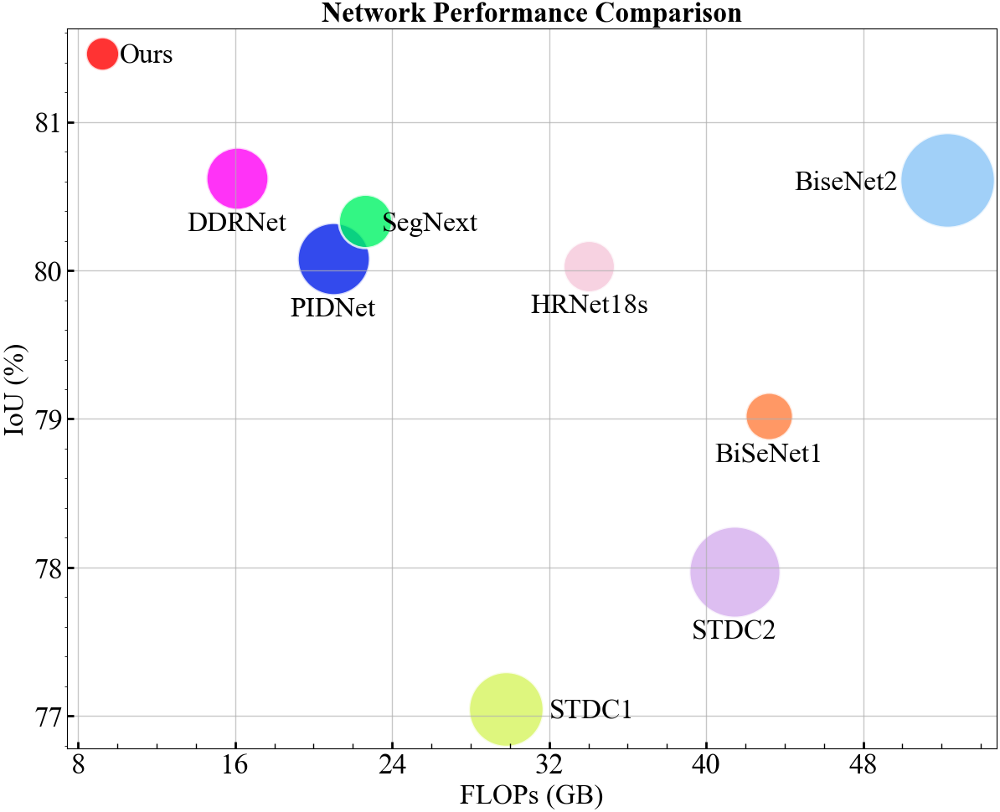
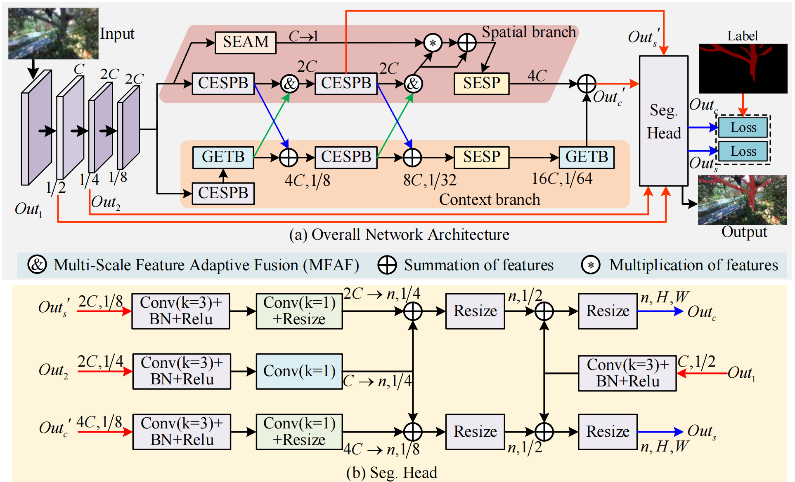

# LED-Net

  

  Compares branch segmentation accuracy, computational cost, and parameter size on the orchard dataset. Smaller circle radii indicate fewer parameters. Our method achieves an optimal balance among these metrics.

  

  (a) Overall network framework, (b) Semantic Segmentation Head.

  

  Qualitative comparison of branch segmentation results on real orchard tree branches. (a) Ground truth; (b) LED-Net; (c) PIDNet; (d) DDRNet; (e) SegNeXt; (f) BiSeNetV2; (g) STDC2; (h) STDC1; (i) HRNet; (j) BiSeNetV1.

## 1. Environment Setup  
This project is built on top of [MMsegmentation](https://github.com/open-mmlab/mmsegmentation). To configure the environment, please follow the official installation guide:  
- [MMsegmentation Installation Guide](https://github.com/open-mmlab/mmsegmentation/blob/main/docs/en/get_started.md#installation)

## 2. Dataset Structure

In addition to the configuration files provided for commonly used public datasets such as Cityscapes, ADE, COCO, and CamVid, we have developed custom dataset loading scripts to accommodate our proprietary *Apple Branch Seg data* dataset. The structure of the dataset is as follows:

<pre>
├── Apple Branch Seg data 
        ├── JPEGImages              # Original images of the dataset 
        ├── SegmentationClassPNG    # Corresponding segmentation labels in PNG format 
        ├── train.txt               # File defining the training data split 
        └── val.txt                 # File defining the validation data split
</pre>

- **JPEGImages**: Directory containing the original images for the dataset.  
- **SegmentationClassPNG**: Directory containing the segmentation labels in PNG format, corresponding to the original images.  
- **train.txt** & **val.txt**: Files that define the data splits for training and validation.

To integrate this dataset into your workflow, please update the dataset path and directory structure in the `../configs/_base_/datasets/pascal_voc12.py` configuration file. Additionally, ensure that the `classes` and `palette` settings in the `../mmseg/datasets/voc.py` file are adjusted to reflect the specific classes and image file extensions used in your dataset.

**Dataset Download**:  
You can download the *Apple Branch Seg data* dataset from [**NWPU-Apple Branch Seg data**](https://drive.google.com/drive/u/0/folders/1Yw_rb0LoRG5CbLaSbzgNX7aReTlF5cWA). 

## 3. Model Training  
To train the LED-Net model, use the configuration file located at:  
`../configs/LED_Net/LEDNet_80k_cityscapes-1024x1024.py`  

Specify the work directory where logs and model checkpoints will be saved:  
`--work-dir`, default path is `../LEDNet_fordata_11g15`. This directory is where logs and models will be stored.  

Adjust additional training parameters according to the provided documentation to suit your specific requirements.

## 4. Model Testing  
For testing the trained model, configure the following settings:  
- **Configuration file**: `../configs/LED_Net/LEDNet_80k_cityscapes-1024x1024.py`  
- **Checkpoint file**: `../lednet_fordata_11g15/iter_80000.pth`  

You can download the pretrained model checkpoint `iter_80000.pth` from [iter_80000.pth](https://drive.google.com/drive/u/0/folders/1Yw_rb0LoRG5CbLaSbzgNX7aReTlF5cWA).

## 5. Model Performance (FLOPs) Testing  
To evaluate the computational complexity of the model (FLOPs), utilize the `get_flops.py` script. Please set the appropriate parameters to obtain the required performance metrics.

## 6. Inference Speed Benchmarking  
For benchmarking the inference speed of the trained model, use the `benchmark.py` script. Adjust the script parameters as needed to assess the model’s efficiency under different conditions.

## Acknowledgements

We would like to express our sincere gratitude to outstanding open-source projects such as [MMsegmentation](https://github.com/open-mmlab/mmsegmentation), [DDRNet](http://arxiv.org/abs/2101.06085), [PIDNet](https://arxiv.org/pdf/2206.02066.pdf), and [DSNet](https://github.com/takaniwa/DSNet) for providing valuable inspiration and technical support for our research. Our project is based on these excellent works, and we have been deeply inspired by their innovative ideas. We are thankful to the open-source community for their contributions, which enable us to continue advancing and innovating upon existing achievements.

